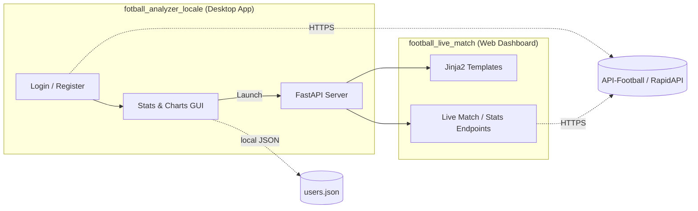
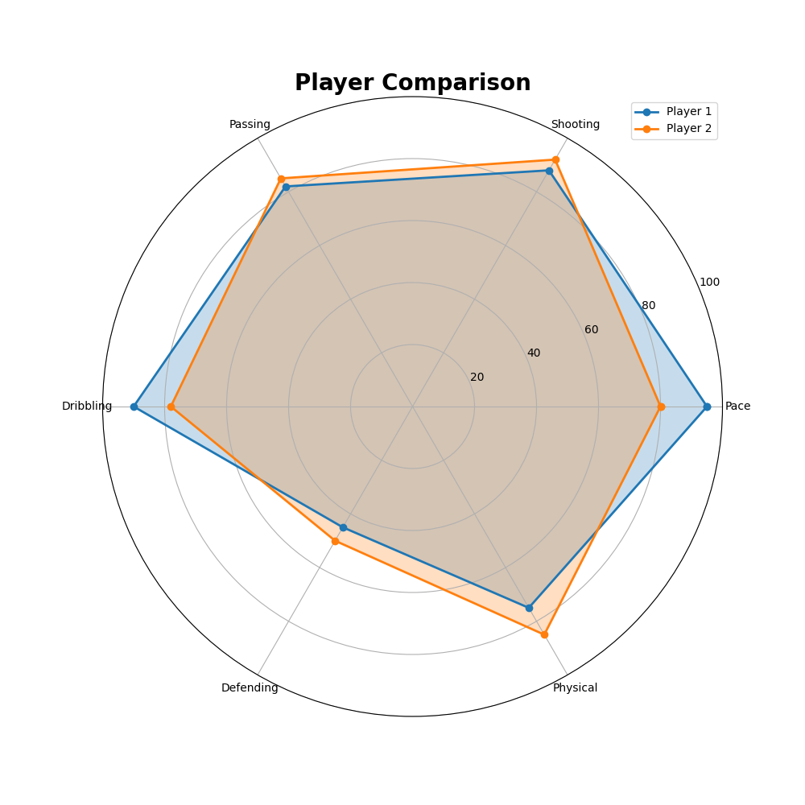
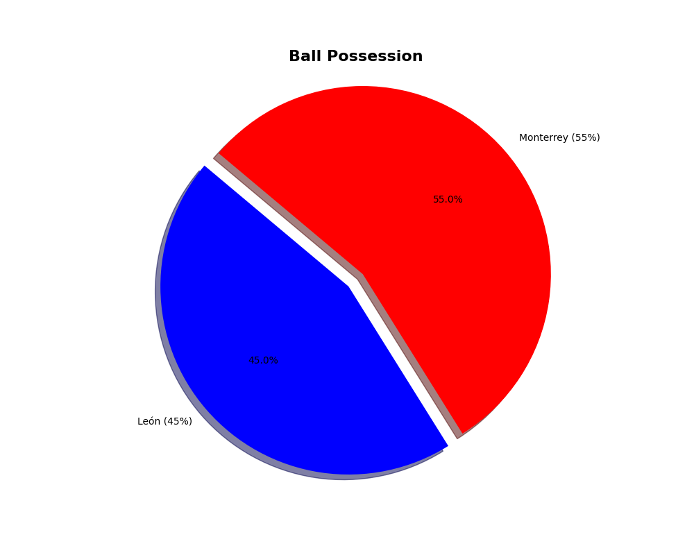

# ⚽ Football Analyzer Project

A football analytics platform combining a **desktop application** (user auth + local data analysis)
with a **web dashboard** (live match stats, event timelines, interactive charts) — both built on top
of the [API-Football](https://rapidapi.com/api-sports/api/api-football) data source.

> First-year Data Engineering project — built as a hands-on exercise in API integration, data
> visualization, and building both desktop (Tkinter/CustomTkinter) and web (FastAPI) interfaces
> around the same data source.

---

## Table of Contents

- [Project Overview](#project-overview)
- [Features](#features)
- [Demo](#demo)
- [Architecture](#architecture)
- [Project Structure](#project-structure)
- [Technologies](#technologies)
- [Installation](#installation)
- [Configuration](#configuration)
- [Usage](#usage)
- [Screenshots](#screenshots)
- [Future Improvements](#future-improvements)
- [License](#license)

---

## Project Overview

This repository contains two independent, complementary applications built around the same
football data API:

| Component | Description |
|---|---|
| **`fotball_analyzer_locale/`** | A desktop app (CustomTkinter) with local user registration/login and football stats/visualizations. |
| **`football_live_match/`** | A FastAPI web dashboard for live match stats, event timelines, and team comparisons. |

They can be run independently, or together — the desktop app can launch the web dashboard directly
from its UI.

---

## Features

- 🔐 User registration & login with salted password hashing (desktop app)
- 📊 Player, team, and league statistics with matplotlib visualizations (bar, pie, radar charts)
- ⚡ Live match tracking with event timelines and possession/shots comparisons (web dashboard)
- 🏆 League standings and top scorer/assister leaderboards
- 🖥️ Modern desktop GUI (CustomTkinter) + responsive web interface (FastAPI + Jinja2)

---

## Demo

A walkthrough video is available at [`docs/media/demo.mp4`](docs/media/demo.mp4).

---

## Architecture



---

## Project Structure

```
.
├── docs/
│   └── media/                    # Screenshots, sample charts, demo video
├── fotball_analyzer_locale/      # Desktop application
│   ├── main.py                   # Stats GUI entry point
│   ├── login.py                  # Auth system + login/register GUI
│   ├── data_handler.py           # API calls + chart generation
│   ├── config.py                 # Loads API credentials from .env
│   ├── users.json                # Local user store (empty template)
│   ├── color_login.json          # CustomTkinter theme
│   ├── assets/                   # Images/icons used by the GUI
│   └── requirements.txt
├── football_live_match/          # Web dashboard
│   ├── src/
│   │   ├── main.py                # FastAPI app + routes
│   │   ├── api_client.py          # API-Football HTTP client (cached, rate-limited)
│   │   ├── data_processing.py     # Response shaping for templates
│   │   ├── config.py              # Loads API credentials from .env
│   │   └── web/                   # Jinja2 templates + static assets
│   ├── legacy/                    # Early prototypes, superseded by src/ (kept for reference)
│   ├── tests/
│   └── requirements.txt
├── LICENSE
└── README.md
```

---

## Technologies

- **Language:** Python 3.9+
- **Desktop:** CustomTkinter, Pillow, Tkinter
- **Web:** FastAPI, Uvicorn, Jinja2, httpx
- **Data & Visualization:** pandas, numpy, matplotlib, scikit-learn
- **Data source:** [API-Football](https://rapidapi.com/api-sports/api/api-football) (RapidAPI)

---

## Installation

```bash
git clone <your-repo-url>
cd <repo-root>
```

### Desktop app

```bash
cd fotball_analyzer_locale
pip install -r requirements.txt
```

### Web dashboard

```bash
cd football_live_match
pip install -r requirements.txt
```

---

## Configuration

Both apps read their API credentials from environment variables via `.env` files — **never commit
real API keys**.

1. Get a free API key from [API-Football on RapidAPI](https://rapidapi.com/api-sports/api/api-football).
2. Copy the example env file in each project and fill in your key:

```bash
# Desktop app
cd fotball_analyzer_locale
cp .env.example .env

# Web dashboard
cd football_live_match
cp .env.example .env
```

---

## Usage

### Desktop app

```bash
cd fotball_analyzer_locale
python login.py
```

Register or log in, then browse league/player stats and visualizations.

### Web dashboard

```bash
cd football_live_match
python src/main.py
```

Open `http://localhost:8000` for live match stats, event timelines, and dashboards.

### Using both together

The desktop app's **"⚽ Live Matches"** button automatically starts the FastAPI server (if it isn't
already running) and opens the web dashboard in your browser.

---

## Screenshots

> Add screenshots of the desktop login screen, stats GUI, and web dashboard here.

| Desktop App | Web Dashboard |
|---|---|
|  |  |

Sample generated charts are available in [`docs/media/charts/`](docs/media/charts/), and a sample
generated dashboard is available in [`football_live_match/match_insights/`](football_live_match/match_insights/).

---

## Future Improvements

- Replace the single-salt SHA-256 password hashing with a per-user salt + a modern KDF (bcrypt/argon2)
- Persist users in a real database instead of a local JSON file
- Add CI (lint + tests) for both projects
- Expand automated test coverage for `football_live_match`
- Dockerize the web dashboard for easier deployment

---

## License

This project is licensed under the [MIT License](LICENSE).
